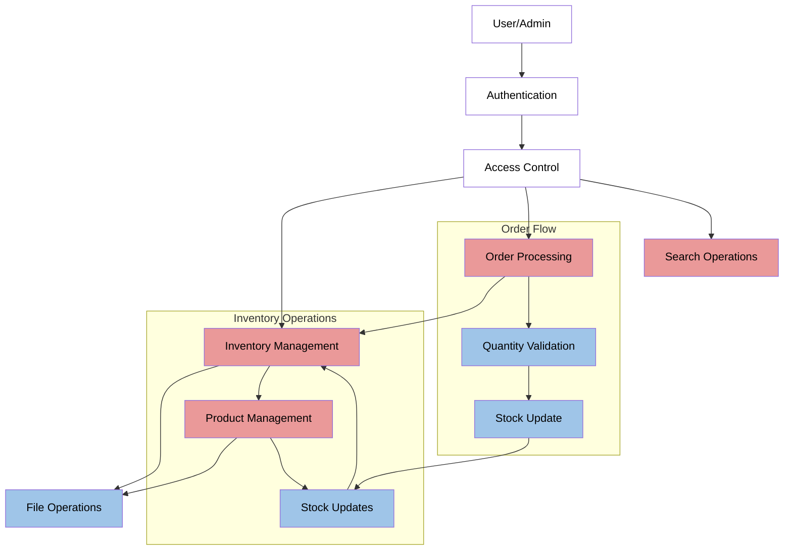

# Inventory Management System

A simple inventory management system built with Java.


## Project Overview
A Java-based inventory management system designed to handle product inventory and orders. The system provides functionality for tracking stock levels, processing orders, and maintaining inventory data with file persistence.

## Installation & Setup

### Prerequisites
- Java Development Kit (JDK) 21 or higher
- Apache Maven 3.6 or higher
- Any text editor or IDE

## Technology Stack
- Java 21
- Maven 3.x
- JUnit 5.10.1 for testing

## Quick Start
```bash
git clone https://github.com/tathagat11/Software-Testing-Project.git
cd inventory-management-system
mvn clean install
mvn exec:java
```

## Project Setup

### Building the Project
1. Clone the repository:
```bash
git clone <repository-url>
cd inventory-management-system
```

2. Build the project:
```bash
mvn clean install
```

### Running the Application
There are several ways to run the application:

1. Using Maven exec plugin:
```bash
mvn exec:java
```

2. Using the compiled JAR:
```bash
# Create executable JAR with dependencies
mvn clean package assembly:single

# Run the JAR
java -jar target/inventory-management-system-1.0-SNAPSHOT-jar-with-dependencies.jar
```

## Default Access
Default admin account:
- Username: admin
- Password: admin123

## Configuration
The application uses a file-based storage system:
- Inventory data is stored in `src/main/resources/inventory.txt`
- File format: CSV with fields: id,name,price,quantity,category

## Testing
The project uses JUnit 5 for testing. Tests can be run using:
```bash
mvn test
```
## Project Structure
```
src/
├── main/
│   ├── java/
│   │   └── com/
│   │       └── inventory/
│   │           ├── models/
│   │           │   ├── Order.java
│   │           │   ├── OrderItem.java
│   │           │   ├── Product.java
│   │           │   └── User.java
│   │           ├── services/
│   │           │   ├── InventoryManager.java
│   │           │   ├── OrderManager.java
│   │           │   ├── SearchService.java
│   │           │   └── UserManager.java
│   │           ├── utils/
│   │           │   └── FileHandler.java
│   │           └── App.java
│   └── resources/
│       └── inventory.txt
└── test/
    └── java/
        └── com/
            └── inventory/
                └── integration
                └── unit
                    └──models
                    └──services
                    └──util
```

## Core Functionalities

### 1. Inventory Management
- **Product Management**
  - Create, read, and update product information
  - Track product quantities in real-time
  - Products persist through file storage system
  - Validation for product data integrity (price, quantity, ID format)

- **Stock Control**
  - Automatic quantity updates on orders
  - Low stock threshold checking
  - Stock validation during order processing

### 2. Order System
- **Order Processing**
  - Create new orders with multiple items
  - Real-time stock validation
  - Three-layer quantity validation:
    * Individual item quantity check
    * Running total validation during order creation
    * Final validation before inventory update
  - Order status tracking (PENDING → COMPLETED)

### 3. User and Security System
- **Access Control**
  - Two roles: Admin and User
  - Basic authentication
  - Role-based operation restrictions
  - Default admin account (username: admin, password: admin123)

## Technical Architecture

### Class Structure

#### Models
1. **Product**
   - Properties: id (alphanumeric), name, price (non-negative), quantity (non-negative), category
   - Input validation for all fields
   - String representation for display

2. **Order**
   - Contains list of OrderItems
   - Tracks order status (PENDING/COMPLETED)
   - Calculates total amount
   - Status transition validation

3. **OrderItem**
   - Links products to orders
   - Manages and validates item quantities
   - Calculates subtotal

4. **User**
   - Stores username, password, and role
   - Role-based access control
   - Password verification

#### Services
1. **InventoryManager**
   - Manages product CRUD operations
   - Handles quantity updates
   - Manages file persistence
   - Provides stock level checks

2. **OrderManager**
   - Creates and processes orders
   - Validates stock availability
   - Updates inventory on order completion
   - Maintains order history

3. **SearchService**
   - Name-based product search
   - Price range filtering with validation
   - Stock level filtering with validation

4. **UserManager**
   - User authentication
   - User registration with uniqueness check
   - Role-based access control
   - Session management

#### Utils
1. **FileHandler**
   - CSV-based inventory persistence
   - Error handling with line number tracking
   - Data format validation

## System Flow Diagram


### Data Management
- File-based persistence for inventory (inventory.txt)
- In-memory data structures:
  * Products: HashMap<String, Product>
  * Orders: HashMap<String, Order>
  * Users: HashMap<String, User>

## Data Flow & Validation

### 1. Product Flow
- Creation: Validates ID format, price, quantity, category
- Updates: Validates new values, persists to file
- Deletion: Not implemented to maintain data integrity

### 2. Order Flow
- Creation: Validates order ID uniqueness
- Item Addition: 
  * Checks product existence
  * Validates quantity against stock
  * Tracks running total per product
- Processing:
  * Validates total quantities
  * Updates inventory
  * Changes status to COMPLETED

### 3. User Flow
- Registration: Validates username uniqueness
- Login: Verifies credentials
- Authorization: Checks role before operations

### 4. File Operations
- Load: Validates data format and values
- Save: Ensures data consistency
- Error Handling: Reports specific file and data issues

## Usage
The system provides a command-line interface with separate menus for admin and regular users:

### Admin Menu
1. View Products
2. Search Products
3. Create Order
4. View Orders
5. Add Product
6. Update Product Quantity
7. View Low Stock Products
8. View Total Inventory Value
9. Save Inventory to File
10. Logout

### User Menu
1. View Products
2. Search Products
3. Create Order
4. View Orders
5. Logout