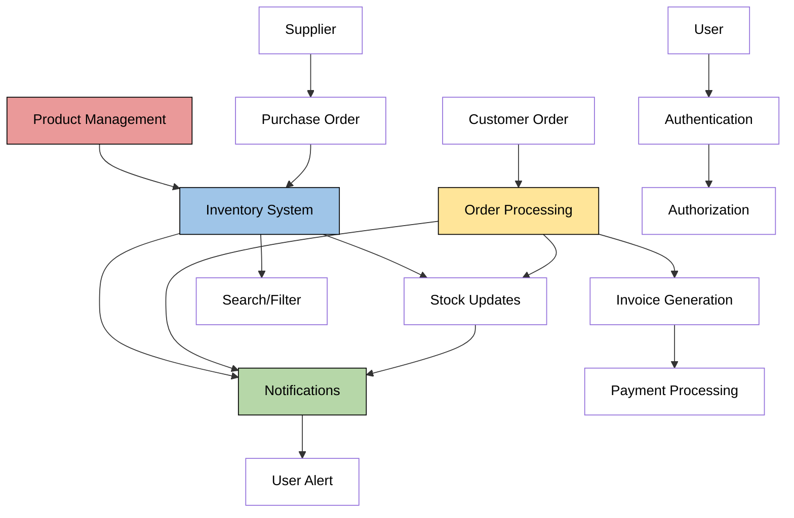

# Inventory Management System

## Project Overview
A comprehensive Java-based inventory management system designed to handle product inventory, orders, and supplier relationships. The system provides functionality for tracking stock levels, processing orders, managing suppliers, and generating detailed reports.

## Features Implemented
1. Inventory Management
   - Product tracking with real-time quantity updates
   - Stock level monitoring with low-stock alerts
   - Category-based organization
   - File-based persistence for inventory data

2. Order Processing
   - Order creation and management
   - Real-time inventory updates on order processing
   - Order status tracking
   - Automatic notifications for order status changes

3. Category Management
   - Product categorization
   - Bulk operations on categories
   - Price updates at category level

4. Search and Filter System
  - Name-based product search
  - Price range filtering
  - Stock level filtering
  - Combined search criteria support

5. User Authentication
  - Role-based access control (Admin/User)
  - Secure login system
  - Operation authorization

6. Notification System
  - Low stock alerts
  - Order status notifications
  - Real-time updates
  - Notification tracking (read/unread)

7. Invoice/Billing System
  - Automatic invoice generation
  - Tax calculations
  - Discount management
  - Payment status tracking

8. Supplier Management
  - Supplier information tracking
  - Supplier-product associations
  - Supplier performance rating
  - Purchase order management

## Core Functionalities

### 1. Inventory Management
- **Product Management**
 - Create, read, update, and delete product information
 - Track product quantities in real-time
 - Automatic stock level monitoring
 - Products persist through file storage system

- **Stock Control**
 - Automatic quantity updates on orders
 - Low stock threshold monitoring
 - Automatic alerts for low stock
 - Stock history tracking

### 2. Order System
- **Order Processing**
 - Create new orders with multiple items
 - Real-time stock validation
 - Automatic inventory updates
 - Order status tracking (Pending → Completed)

- **Invoice Generation**
 - Automatic invoice creation for orders
 - Tax calculations (10% rate)
 - Discount application support
 - Payment status tracking

### 3. Supplier and Purchase Management
- **Supplier Operations**
 - Supplier profile management
 - Performance rating system
 - Contact information tracking
 - Supplier-product associations

- **Purchase Orders**
 - PO creation and approval workflow
 - Multiple item support
 - Status tracking (Pending → Approved → Received)
 - Automatic inventory updates on receipt

### 4. User and Security System
- **Access Control**
 - Role-based permissions (Admin/User)
 - Secure login system
 - Operation authorization checks
 - Default admin account

### 5. Notification and Reporting
- **Notification System**
 - Event-based notifications
 - Multiple notification types (Low Stock, Order Status, etc.)
 - Read/Unread status tracking
 - User-specific notifications

- **Reporting**
 - Sales reports
 - Inventory status reports
 - Low stock alerts
 - Supplier performance tracking

## Technical Architecture

### Class Structure

#### Models
1. **Product**
  - Core entity for inventory items
  - Properties: id, name, price, quantity, category
  - Supports price and quantity modifications

2. **Order**
  - Represents customer orders
  - Contains list of OrderItems
  - Manages order status and total calculations

3. **Category**
  - Organizes products
  - Supports bulk operations
  - Maintains category-product relationships

4. **User**
  - Manages user authentication
  - Handles role-based permissions
  - Stores user credentials

#### Services
1. **InventoryManager**
  - Central service for product management
  - Handles file persistence
  - Manages product quantities

2. **OrderManager**
  - Processes orders
  - Updates inventory
  - Maintains order history

3. **SearchService**
  - Provides advanced search capabilities
  - Implements filters for:
    * Name-based search
    * Price range filtering
    * Stock level filtering
    * Combined criteria search

4. **ReportGenerator**
  - Generates comprehensive system reports
  - Handles different report types:
    * Sales reports
    * Inventory status
    * Low stock alerts

5. **NotificationService**
  - Manages system notifications
  - Handles different notification types
  - Tracks notification status

6. **InvoiceService**
  - Manages order billing
  - Handles tax calculations
  - Processes discounts
  - Tracks payment status

7. **SupplierManager & PurchaseOrderManager**
  - Manages supplier relationships
  - Handles purchase orders
  - Tracks supplier ratings
  - Updates inventory on PO receipt

### Data Management
- File-based persistence for inventory
- In-memory data structures for:
 * Orders and Invoices
 * User sessions
 * Notifications
 * Supplier data
 * Purchase Orders

## Data Flow Description

### 1. Inventory Flow
- **Product Creation → Storage**
 * Product created with initial quantity
 * Stored in inventory map
 * Persisted to file system
 * Category assignment

- **Quantity Updates**
 * Through order processing
 * Through purchase order receipt
 * Through direct inventory adjustment
 * Triggers low stock notifications

### 2. Order Processing Flow
- **Order Creation → Fulfillment**
 * Order created with items
 * Stock validation
 * Quantity deduction
 * Status update
 * Invoice generation
 * Notification dispatch

### 3. Purchase Order Flow
- **PO Creation → Stock Update**
 * Created with supplier
 * Items added
 * Approval process
 * Receipt processing
 * Inventory update
 * Supplier rating update

### 4. Financial Flow
- **Order → Invoice → Payment**
 * Order total calculation
 * Tax application (10%)
 * Discount processing
 * Invoice generation
 * Payment status tracking

### 5. Notification Flow
- **Event → Notification → Delivery**
 * Event triggers (low stock, order status, etc.)
 * Notification creation
 * User notification
 * Status tracking (read/unread)

### 6. User Authentication Flow
- **Login → Authorization → Operation**
 * User credentials verification
 * Role checking
 * Permission validation
 * Operation execution

### 7. Search and Filter Flow
- **Query → Filter → Results**
 * Search criteria input
 * Multiple filter application
 * Result compilation
 * Data presentation

### System Flow Diagram
