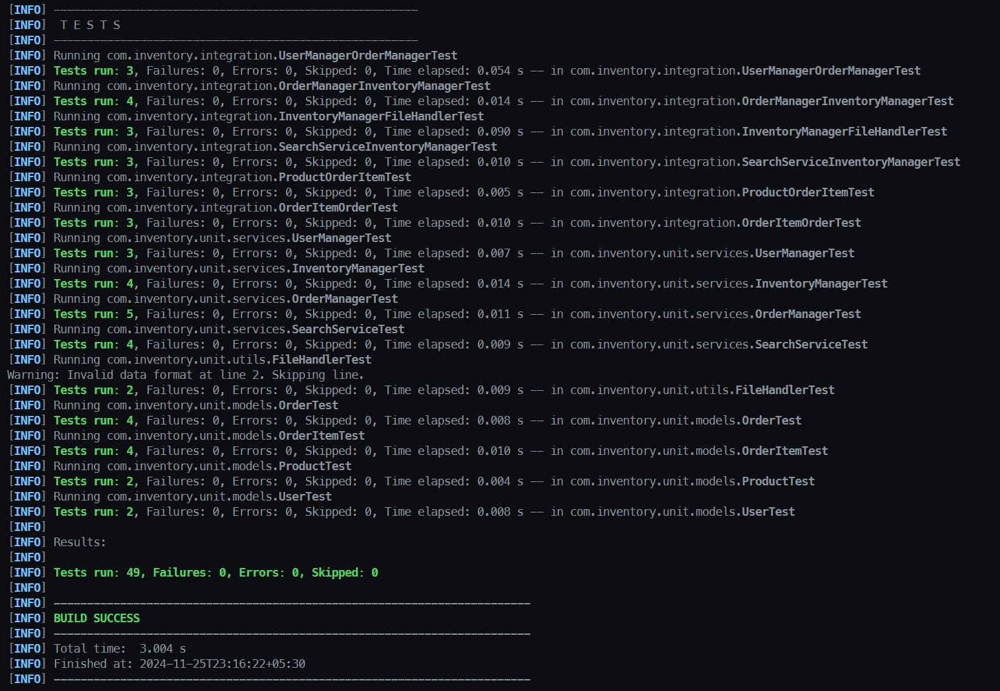

# Data Flow Testing Documentation

## Testing Strategy
**Data flow Graph**: graph based testing, with only data flow criteria.

## Project github link:

[Github](https://github.com/tathagat11/Software-Testing-Project)

## Individual Contribution
1. Tathagata Talukdar (MT2023189):
2. Som Shiv Gupta ():

## 1. Component Analysis
This section identifies all definitions and their uses for data flow testing requirements.

### Models Layer

#### Product
Definitions:
- Fields: id, name, price, quantity, category
- Constructor parameters match field names
Uses:
- Getters: direct field access
- Setters: field modifications
- Validation: price and quantity checks

#### Order
Definitions:
- Fields: orderId, items (List), status, orderDate
- Static: VALID_STATUSES Set
Uses:
- Loop: getTotalAmount() iterates through items list
- Status management: PENDING → COMPLETED states
Key DU Path: items list definition → loop iteration → total calculation

#### OrderItem
Definitions:
- Fields: product (Product reference), quantity
- Constructor validates parameters
Uses:
- getSubtotal(): uses product price and quantity
- Validation: checks stock availability
Key DU Path: product definition → price retrieval → subtotal calculation

#### User
Definitions:
- Fields: username, password, role
- Constructor initializes all fields
Uses:
- Authentication: password verification
- Role checking: access control
Key DU Path: credentials definition → authentication validation

### Services Layer

#### InventoryManager
Definitions:
- inventory: Map<String, Product>
- fileHandler: FileHandler reference
Uses:
- Product CRUD operations
- Stock calculations (contains loops)
- File persistence operations
Key DU Path: inventory map definition → product storage → stock updates

#### OrderManager
Definitions:
- orders: Map<String, Order>
- inventoryManager reference
Uses:
- Order processing loop
- Stock validation and updates
Key DU Path: orders map definition → processing loop → inventory updates

#### SearchService
Definitions:
- inventoryManager reference
Uses:
- Stream operations (loops) for filtering
- Product search and filtering
Key DU Path: product list definition → stream processing → filtered results

#### UserManager
Definitions:
- users: Map<String, User>
- currentUser: User reference
Uses:
- Session management
- Role-based authorization
Key DU Path: user definition → login → session management

### Utils Layer

#### FileHandler
Definitions:
- FILE_PATH constant
- Product list for operations
Uses:
- File reading loop
- File writing operations
Key DU Path: file content definition → parsing loop → product creation

## 2. Testing Strategy

### Models Testing
1. Product Unit Test
   - Field definitions → getter uses
   - Constructor params → field uses
   - Setters → field updates

2. OrderItem Unit Test
   - Product reference flow
   - Quantity definitions
   - Subtotal calculation uses

3. Order Unit Test
   - Items list definition
   - Loop in getTotalAmount
   - Status transitions

4. User Unit Test
   - Credentials definitions
   - Role-based uses

### Services Testing
1. InventoryManager Unit Test
   - Map operations
   - Product management
   - Stock calculations

2. OrderManager Unit Test
   - Order creation flow
   - Processing loop coverage
   - Stock updates

3. SearchService Unit Test
   - Search parameter definitions
   - Filter operations
   - Stream processing

4. UserManager Unit Test
   - User management
   - Session handling

### Integration Testing
1. Base Flow Tests
   - Product → OrderItem
   - OrderItem → Order
   
2. Service Flow Tests
   - InventoryManager → FileHandler
   - OrderManager → InventoryManager
   - SearchService → InventoryManager
   - UserManager → OrderManager

# 3. Test Implementation

## Unit Test Templates

### Definition-Use Coverage Template
```java
@Test
void testDefinitionsAndUses() {
    // 1. Setup definitions
    Type variable = new Type();
    
    // 2. Exercise uses
    Result result = variable.method();
    
    // 3. Verify definition reached use
    assertEquals(expected, result);
}
```

### Loop Coverage Template
```java
@Test
void testLoopDefinitionUse() {
    // 1. Setup collection definitions
    List<Type> items = createItems();
    
    // 2. Exercise loop
    Result result = processItems(items);
    
    // 3. Verify all definitions used
    verifyProcessing(result);
}
```

## Integration Test Templates

### Cross-Component Flow Template
```java
@Test
void testComponentInteraction() {
    // 1. Setup first component definitions
    FirstComponent first = new FirstComponent();
    
    // 2. Flow to second component
    SecondComponent second = new SecondComponent(first);
    
    // 3. Verify definition flow
    assertEquals(expected, second.getResult());
}
```

## 4. Coverage Evidence
### Screenshots
#### 1. Test Result
```bash
mvn clean test
```



#### 2. Test File Structure


### Data Flow Graphs

#### System-Wide Data Flow


### Data Flow in Loops
